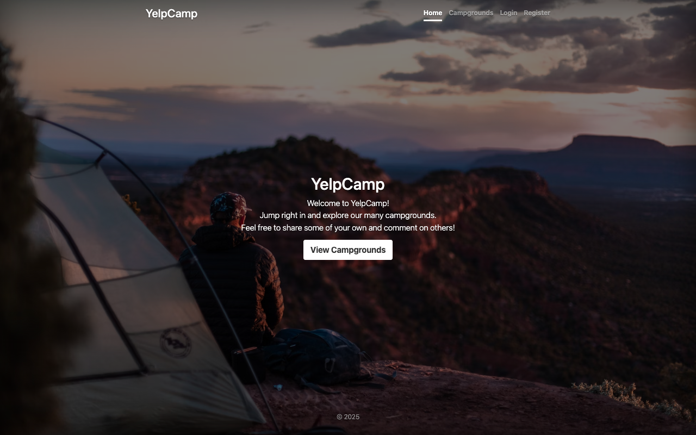
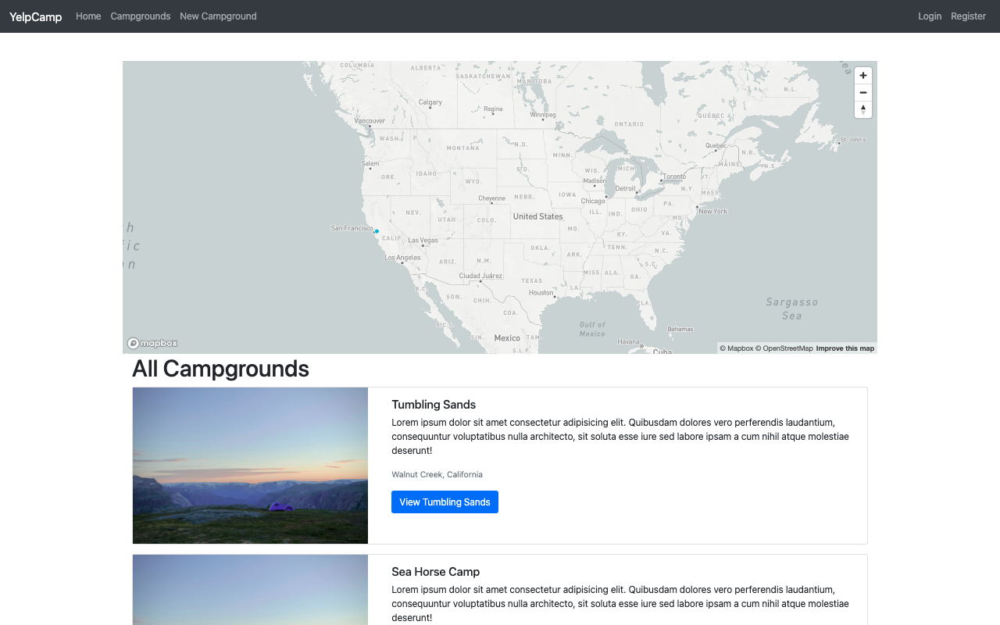
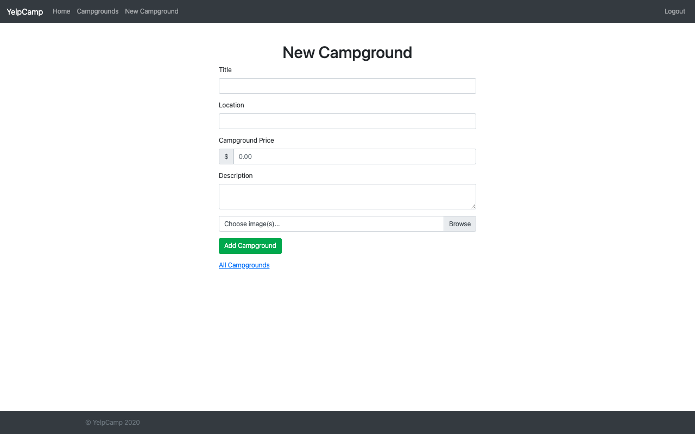
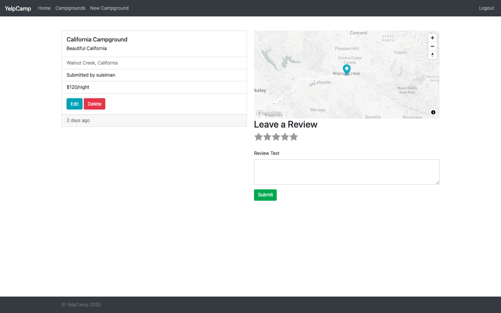
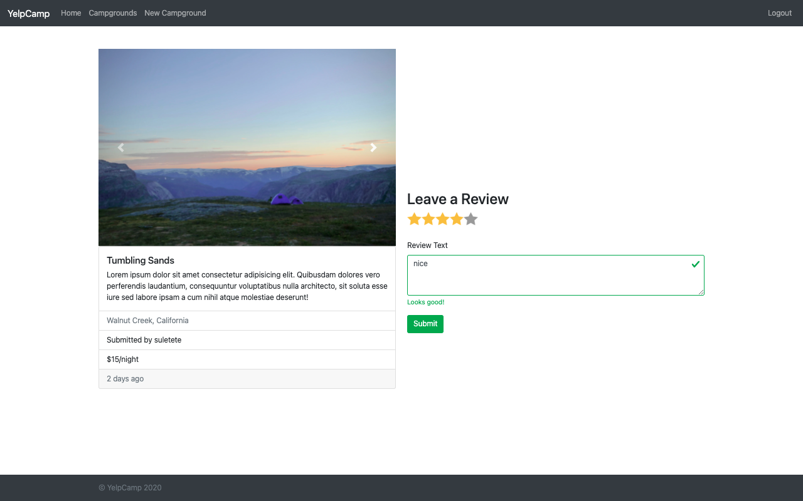

# YelpCamp

A full-stack web application for sharing and reviewing campgrounds. This project is an implementation of the YelpCamp application from a Node/Express/MongoDB course. It supports user authentication, image uploads (Cloudinary), reviews, and interactive maps (Mapbox).

## Features
- Create, read, update and delete campgrounds
- User authentication (Passport.js)
- Add and delete reviews
- Image upload with Cloudinary
- Mapbox integration for location and clustering
- Server-side validation and sanitization

## Screenshots
Home page

All campgrounds

New campground form

Added campground (show page)

Campground details

## Requirements
- Node.js (12+)
- npm
- MongoDB
- Cloudinary account (for image uploads)
- Mapbox token (for maps)

## Installation
1. Clone the repository
   git clone <repo-url>
2. Install dependencies
   npm install
3. Create a .env file in the project root and add the following variables:
   DB_URL=your_mongodb_connection_string
   SECRET=your_session_secret
   CLOUDINARY_CLOUD_NAME=your_cloud_name
   CLOUDINARY_KEY=your_cloudinary_api_key
   CLOUDINARY_SECRET=your_cloudinary_api_secret
   MAPBOX_TOKEN=your_mapbox_token

4. (Optional) Seed the database with sample campgrounds:
   node seeds/index.js

5. Start the app
   npm start

Open http://localhost:3000 in your browser.

## Project structure (important files)
- app.js — application entry and configuration
- models/ — Mongoose models (Campground, Review, User)
- routes/ — Express route handlers
- controllers/ — controller logic for routes
- views/ — EJS templates
- public/ — static assets (CSS, client JS)
- showCaseImages/ — screenshots used in this README

## Notes
- The Content Security Policy in app.js allows images from Cloudinary and Unsplash. Update the cloud name in app.js if using a different account.
- Make sure MongoDB is running or point DB_URL to a remote database.

